### 📇INDEX

1. [맘쏙 서비스 소개](#💌맘쏙-서비스-소개)
2. [주요 서비스 화면](#👀주요-서비스-화면)
3. [주요 기술 스택](#🤖주요-기술-스택)
4. [팀원 소개](#👪팀원-소개)
5. [프로젝트 산출물](#📚프로젝트-산출물)

# 💌맘쏙 서비스 소개

우리 아이의 마음 일기장, 맘쏙은 아이들이 바쁜 부모님과 교감할 수 있는, 부모님이 아이와 함께 있지 않더라도 아이의 마음을 이해하고 공감할 수 있게 정서적인 교류를 도와주는 그림일기 서비스 입니다. 

# 👀주요 서비스 화면

#### 아이 사용자 입장 페이지

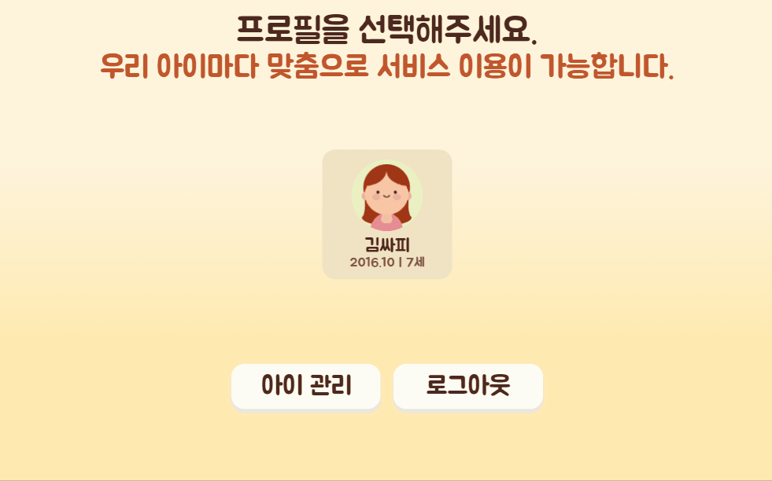

#### 그림 그리기 페이지

✅ 그림 도구 선택

+ 아이 사용자가 실제로 그리는 듯한 느낌이 들도록 다양한 그림 도구 제공
+ 크레파스, 색연필 등의 질감 구현

✅ 다양한 색상

+ 총 14 가지의 색상으로 아이들이 원하는 대로 그림 그리기 가능

✅ 지우기 기능

+ 그림 도구에서 제공하는 지우개와 전체 지우기 기능 제공

✅ 기본 그리기

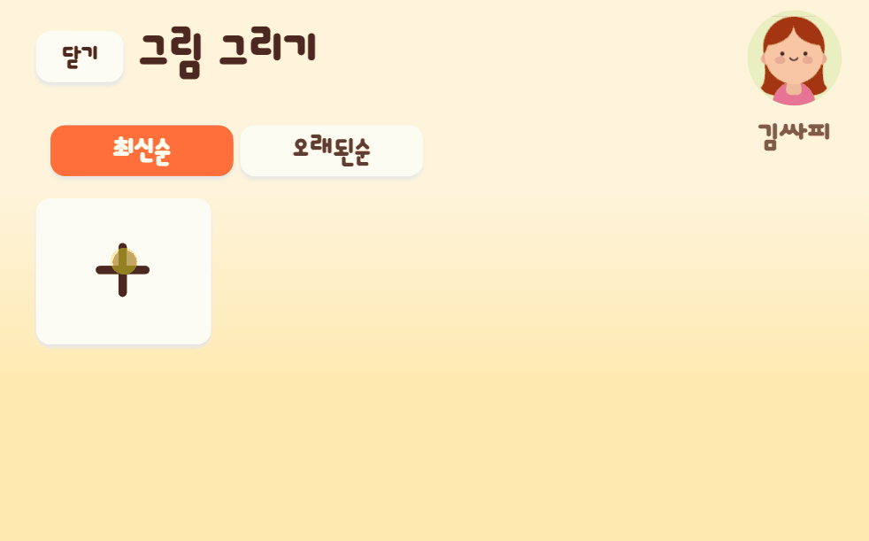

✅ 모션 인식 그리기

+ 아이 사용자의 손동작을 인식하여 그림 도구 선택, 색상 선택, 그림 그리기 모두 가능

✅ 그림 태그 기능

+ 아이 사용자의 그림을 분석하여 자동으로 해시태그를 만들어 주는 기능

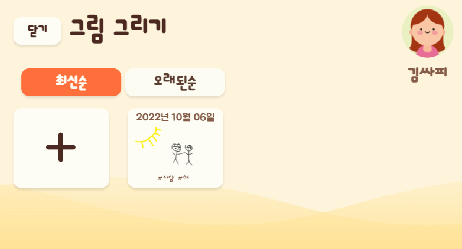

#### 일기 작성 페이지

✅ 그림 불러오기 기능 & 새로 그리기 기능

+ 이미 그렸던 그림 불러오기, 새로 그리기 모두 가능

#### 표정 달력 페이지

✅ 감정 분석 기능

+ 아이가 쓴 일기의 감정 분석에 맞는 표정 이모티콘을 날짜에 맞게 달력에서 보여주는 기능

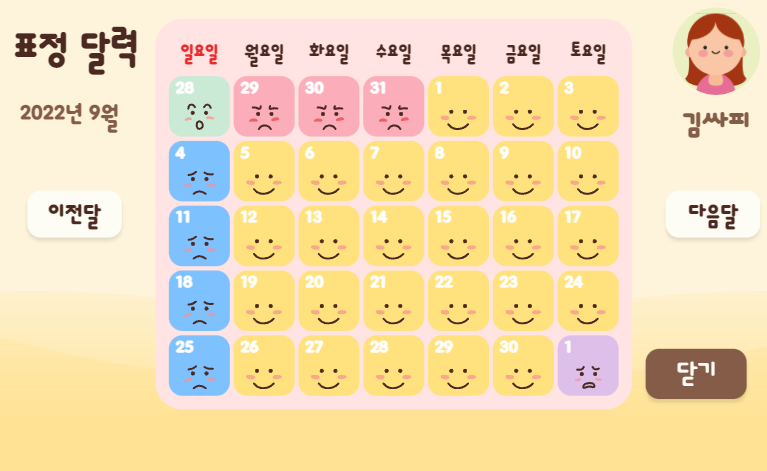

#### 칭찬 도장 페이지

✅ 칭찬 도장 기능

+ 부모 사용자가 아이 사용자에 대해 할 일 목록을 지정해주고 이를 달성하면 도장을 찍어줌
+ Done 처리는 부모 사용자와 아이 사용자 모두 가능하지만 도장 찍는 기능은 부모 사용자만 가능

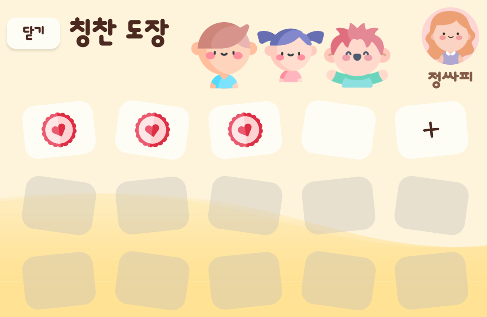

#### 편지 페이지

✅ 편지 쓰기 & 읽기 기능

+ 부모 사용자와 아이 사용자의 유대감 생성을 위한 편지 기능
+ 영상 녹화 기능을 통한 영상 편지 기능 탑재
+ 형제, 자매도 편지를 주고 받을 수 있음

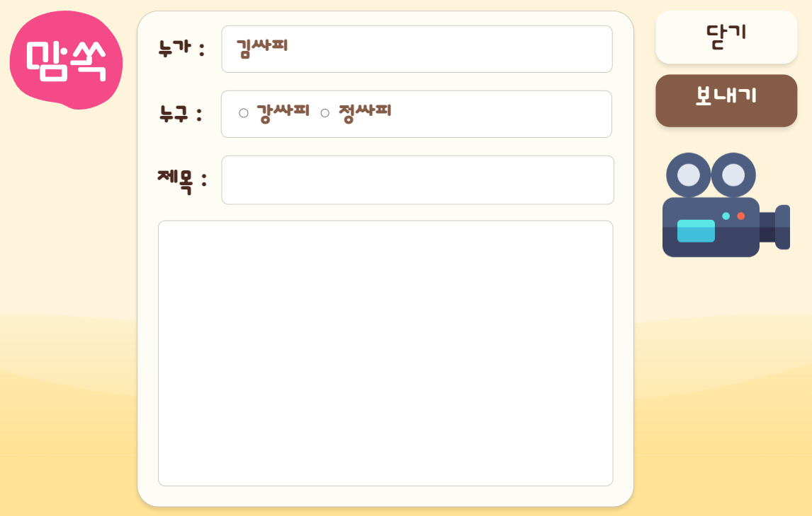

#### 동물 도감 페이지

✅ 동물 따라 그리기

+ 선택한 동물의 간단한 설명과 따라 그릴 수 있도록 reference 제공
+ 동물의 소리와 부위 별 움직임 구현

#### 동요 나라 페이지

✅ 동요 제공

+ 미취학 아동들이 좋아하는 동요 6 가지를 제공하는 서비스

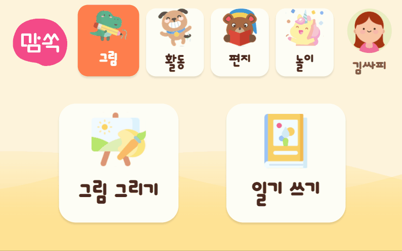

#### 아이 사용자 관리 페이지

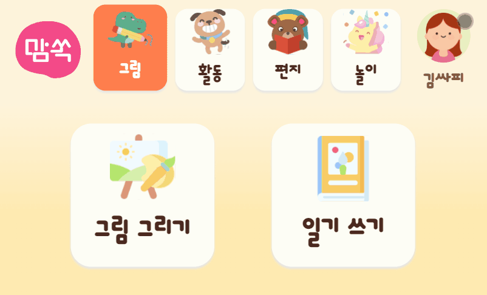

#### 진단 리포트 페이지

✅ 아이 사용자의 감정 진단 리포트

+ 일기 내용을 기반으로 한 감정 분석 결과를 오늘, 이번 주, 이번 달로 나누어 제공
+ 감정 분석 결과는 Sigmoid를 역으로 계산 하여 5 가지의 감정을 % 로 나타냄

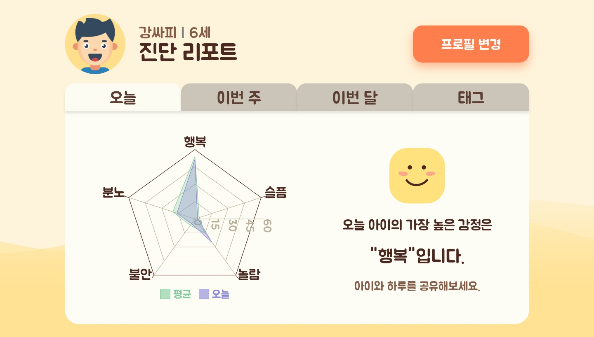

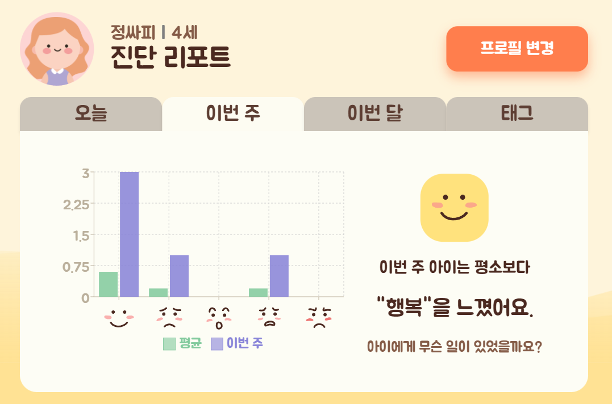

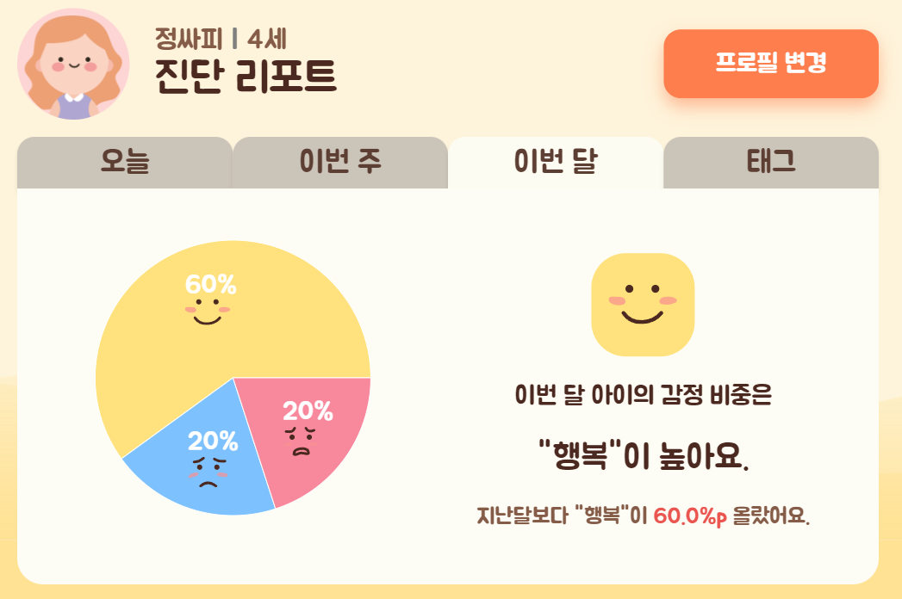

#### 활동 내역 페이지

✅ 아이 사용자의 활동 내역 확인

+ 아이 사용자가 그린 그림과 작성한 그림 일기를 볼 수 있음

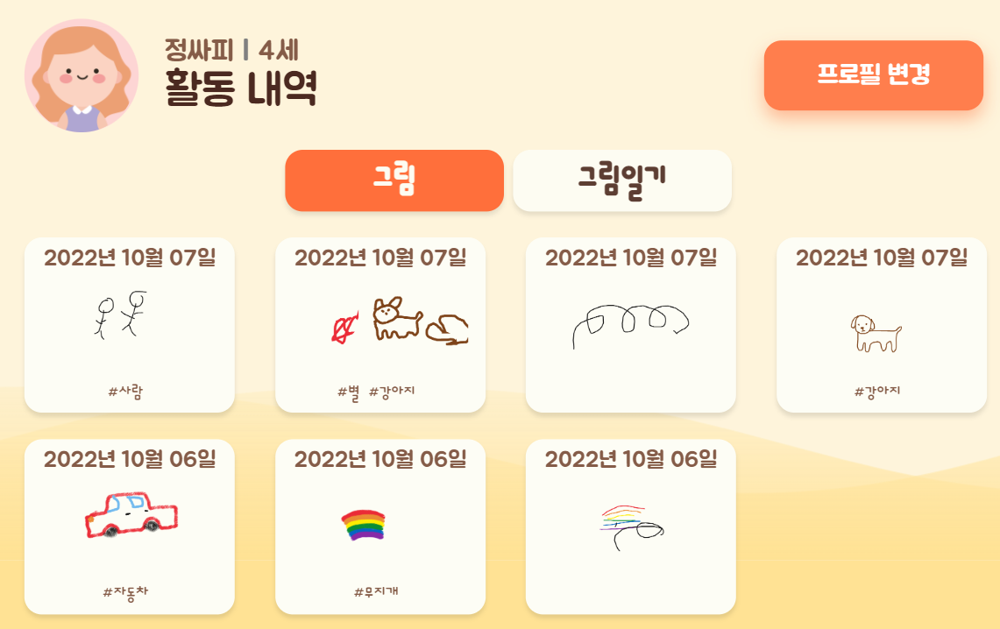

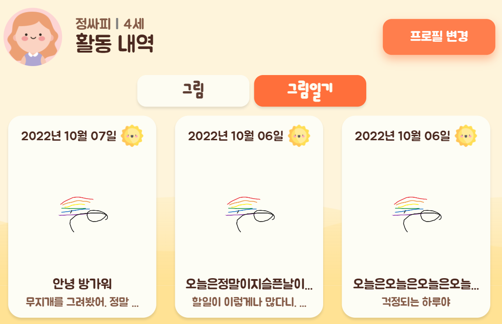

#### 약속 관리 페이지

✅ 약속 생성

+ 부모 사용자는 아이 사용자가 해야 할 일을 지정할 수 있음
+ 아이 사용자가 그 일을 했을 때 도장을 찍어줌

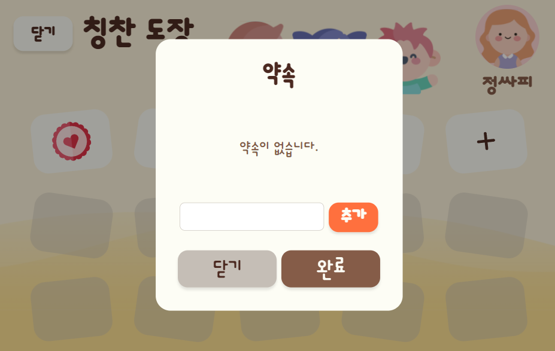

# 🤖주요 기술 스택

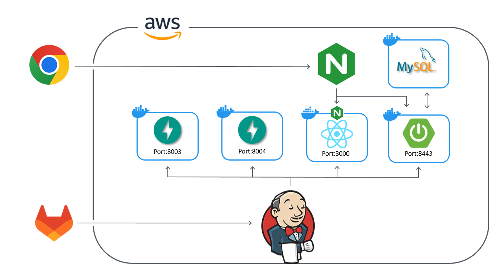

#### Frontend

+ 

+ 
+ 
+ 
+ 

#### Backend

+ 
+ 

#### AI

+ 
+ 
+ 
+ 
+ 
+ 
+ 
+ 

#### Infra

+ 
+ 
+ 

**ETC**

- 
- 
- 
- 

# 👪팀원 소개

## 팀원

<table>
    <tr>
        <td height="140px" align="center">
              강보경</a>  
        </td>
        <td height="140px" align="center">
              고광</a>  
        </td>
        <td height="140px" align="center">
              김다은</a>  
        </td>
    </tr>
    <tr>
        <td align="center">
        팀장/Front-End
        </td>
        <td align="center">
        팀원/AI
        </td>
        <td align="center">
        팀원/AI
        </td>
    </tr>
</table>
<table>
    <tr>
        <td height="140px" align="center">
              김성령</a>  
        </td>
        <td height="140px" align="center">
              김필재</a>  
        </td>
        <td height="140px" align="center">
              박찬석</a>  
        </td>
    </tr>
    <tr>
        <td align="center">
        팀원/Back-End
        </td>
        <td align="center">
        팀원/Back-End
        </td>
        <td align="center">
        팀원/Front-End
        </td>
    </tr>
</table>

# 📚프로젝트 산출물

## Notion

👉[우리 아이 마음 일기장, 맘쏙](https://www.notion.so/db4354aafdfc4396a8e960802a163659)

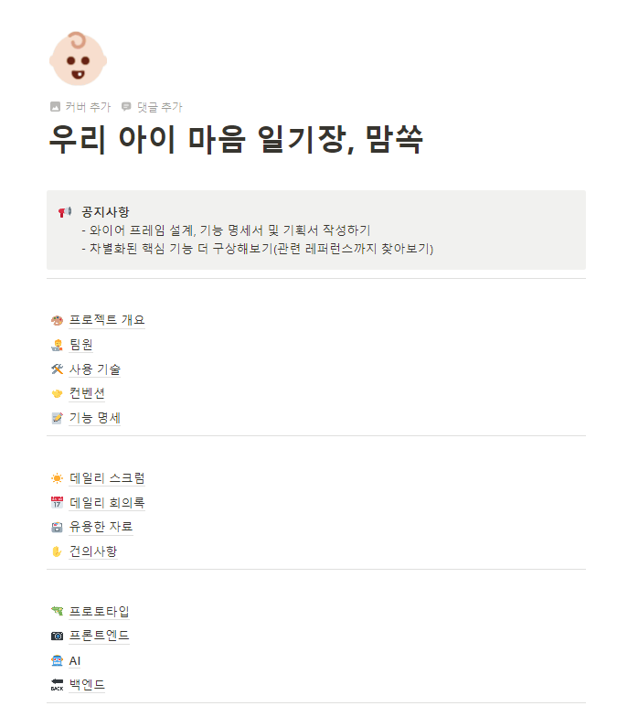

## Mockup

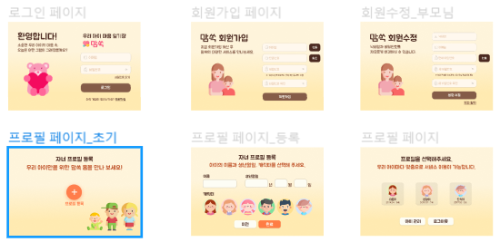

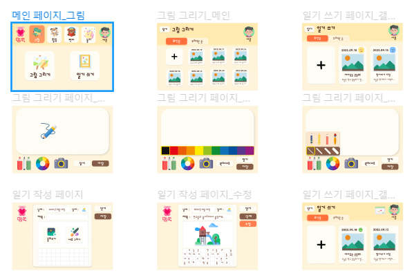

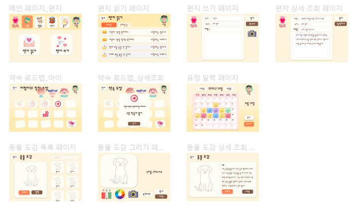

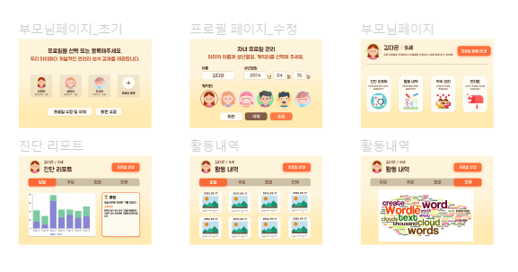

## ERD

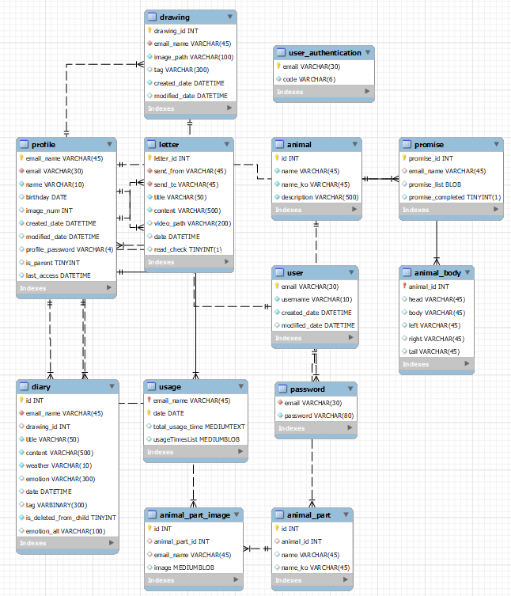
