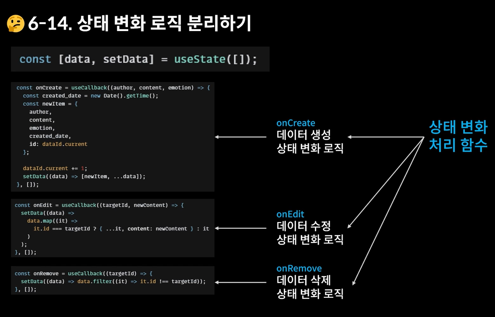
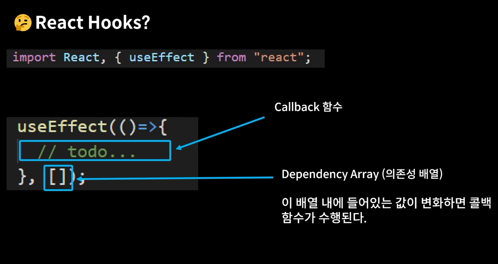
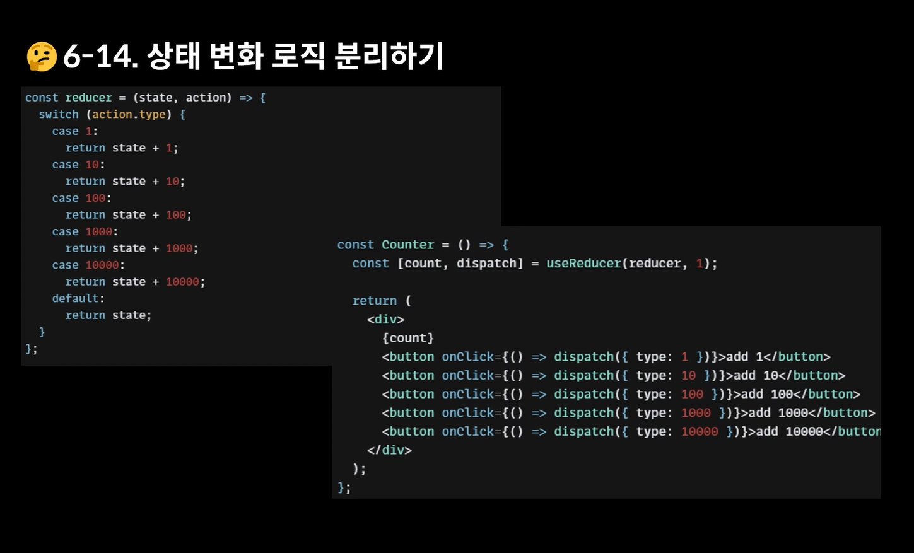
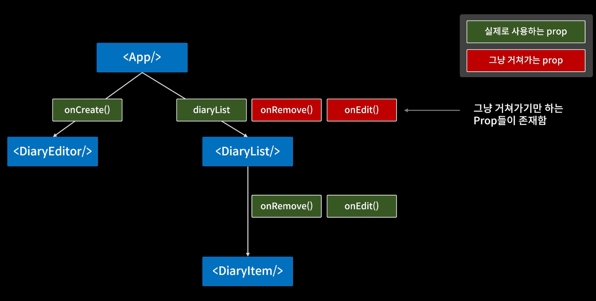
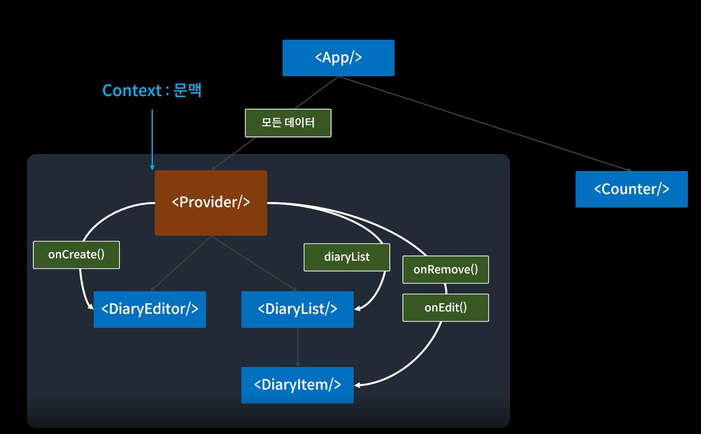
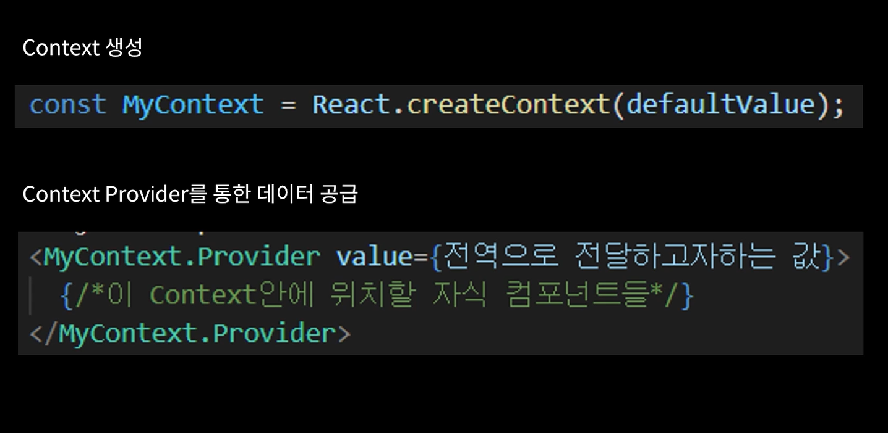

# React_Summary


## 0. React 프로젝트 생성

```bash
프로젝트 생성 명령어
npx react-create-app

패키지 설치 명령어
npm install

React Router
npm install react-router-dom@6
```

### 0-1. 프로젝트 초기 세팅

```bash
삭제할 파일
App.test.js
logo.svg
reportWebVitals.js
setupTests.js

불필요한 코드 삭제
App.css
App.js
index.js
```

------

## 1. 컴포넌트 기본 구조

```javascript
const Home = () => {
	return (
		<div>
			<h1>Home.js</h1>
		</div>
	);
};

export default Home;
```

------

## 2. 페이지 라우팅

```javascript
import { BrowserRouter, Route, Routes } from "react-router-dom";

import Home from "./pages/Home";

function App() {
  return (
	<BrowserRouter>
	  <div className="App">
		<h1>App.js</h1>
		<Routes>
		  <Route path="/" element={<Home />} />
		</Routes>
	  </div>
	</BrowserRouter>
  );
}

export default App;
```

### 2-1. 컴포넌트 라우팅

```javascript
import { Link } from "react-router-dom";

import Home from "./pages/Home";

const RouteTest = () => {
  return (
	<>
	  <Link to={"/"}>HOME</Link>
	</>
};

export default App;
```

### 2-2. React Router Dom

### 2-2-1. Path Variable

- **useParams**

  App.js

  ```javascript
  import { BrowserRouter, Route, Routes } from "react-router-dom";
  
  import Home from "./pages/Home";
  import Diary from "./pages/Diary";
  
  function App() {
    return (
  	<BrowserRouter>
  	  <div className="App">
  		<h1>App.js</h1>
  		<Routes>
  		  <Route path="/" element={<Home />} />
  		  <Route path="/diary/:id" element={<Diary />} /> // useParmas
  		</Routes>
  	  </div>
  	</BrowserRouter>
    );
  }
  
  export default App;
  ```

  Diary.js

  ```javascript
  import { useParams } from "react-router-dom";
  
  const Diary = () => {
  
    const { id } = useParams(); // useParmas
  
  	return (
  		<div className="DiaryPage">
  			<h1>Diary</h1>
  			console.log(id)
  		</div>
  	);
  };
  
  export default Diary;
  ```

### 2-2-2. Query String

- **useSearchParams**

  Edit.js

  ```javascript
  import { useSearchParams } from "react-router-dom";
  
  const Edit = () => {
  
    const [searchParams, setSearchParams] = useSearchParmas();
  
  	const id = searchParams.get("id");  // searchParmas
  	console.log("id : ", id);
  
  	return (
  		<div className="EditPage">
  			<h1>Edit</h1>
  			<button onClick={() => setSearchParams({who: "jay"})}> // setSearchParams
  				QS 바꾸기
  			</button>
  		</div>
  	);
  };
  
  export default Edit;
  ```

### 2-2-3. Page Moving

- **useNavigate**

  Edit.js

  ```javascript
  import { useNavigate } from "react-router-dom";
  
  const Edit = () => {
  
    const navigate = useNavigate();  // useNavigate
  
  	return (
  		<div className="EditPage">
  			<h1>Edit</h1>
  			<button onClick={() => {
  					navigate("/home");    // useNavigate
  				}}
  			>
  				Home으로 가기
  			</button>
  			<button onClick={() => {
  					navigate(-1);       // useNavigate
  				}}
  			>
  				뒤로가기
  			</button>
  		</div>
  	);
  };
  
  export default Edit;
  ```

------

## 3. 컴포넌트 초기 세팅

### 3-1. 버튼

MyButton.js

```javascript
const MyButton = ({ text, type, onClick }) => {

  const btntype = ["positive", "negative"].includes(type) ? type : "default";

  return (
    <button
      className={["MyButton", `MyButton_${btntype}`].join(" ")}
      onClick={onClick}
    >
      {text}
    </button>
  );
};

MyButton.defaultProps = {
  type: "default",
};

export default MyButton;
```

### 3-2. 헤더

MyHeaders.js

```javascript
const MyHeader = ({ headText, leftChild, rightChild }) => {

  return (

    <header>
      <div className="head_btn_left">{leftChild}</div>
      <div className="head_text">{headText}</div>
      <div className="head_btn_right">{rightChild}</div>
    </header>
  );
};

export default MyHeader;
```

사용법

```javascript
import MyHeader from "./../components/MyHeader";
import MyButton from "./../components/MyButton";

  return (
    <div>
      <MyHeader
        headText={headText}
        leftChild={<MyButton text={"<"} onClick={decreaseMonth} />}
        rightChild={<MyButton text={">"} onClick={increaseMonth} />}
      />
    </div>
  );
```

### 3-3. Container

Container.js

```javascript
const Container = ({ children }) => {
  console.log(children);
  return (
    <div style={{ margin: 20, padding: 20, border: "1px solid gray" }}>
      {children}
    </div>
  );
};

export default Container;
```

App.js

```javascript
import React from "react";
import Container from "./Container";

function App() {

  return (
    <Container>
      <div>
				<h2> Container 자식 요소는 children !!</h2> // container
      </div>
    </Container>
  );
}
export default App;
```

------

## 4. React Hooks

### 4-1. **useState (상태)**



```javascript
import React, { useState } from "react";

// const Counter = (props) => {   // props
const Counter = ({ initialValue }) => {  // props
  const [count, setCount] = useState(initialValue);

  const onIncrease = () => {
    setCount(count + 1);
  };

  const onDecrease = () => {
    setCount(count - 1);
  };

  return (
    <div>
      <h2>{count}</h2>
      <button onClick={onIncrease}>+</button>
      <button onClick={onDecrease}>-</button>
    </div>
  );
};

Counter.defaultProps = {
  initialValue: 0,
};

export default Counter;
```

### 4-2. Props

```javascript
import React from "react";
import Counter from "./Counter";

function App() {

  const counterProps = {
    a: 1,
    b: 2,
    c: 3,
    d: 4,
    e: 5,
    initialValue: 5,
  };

  return (
    <Container>
      <div>
        <MyHeader />
        <Counter {...counterProps} />  // props
      </div>
    </Container>
  );
}

export default App;
```

### 4-3. useRef

```javascript
import React, { useRef } from "react";
import { DiaryDispatchContext } from "./App";

const DiaryEditor = () => {

  const authorInput = useRef();   // useRef
  const contentInput = useRef();   // useRef

const handleSubmit = () => {
    if (state.author.length < 1) {
      authorInput.current.focus();
      return;
    }
    if (state.content.length < 5) {
      contentInput.current.focus();
      return;
    }

    onCreate(state.author, state.content, state.emotion); // onCreat    alert("저장 성공");
    setState({
      author: "",
      content: "",
      emotion: 1,
    });
  };

  return (
    <div className="DiaryEditor">
      <h2>오늘의 일기</h2>
      <div>
        <input
          ref={authorInput}   // useRef
          name="author"
          value={state.author}
          onChange={handleChangeState}
        />
      </div>
      <div>
        <textarea
          ref={contentInput}   // useRef
          name="content"
          value={state.content}
          onChange={handleChangeState}
        />
      </div>

      <div>
        <button onClick={handleSubmit}>일기 저장하기</button>
      </div>
    </div>
  );
};

export default React.memo(DiaryEditor);
```

### 4-4. useEffect



```javascript
import React, { useEffect, useState } from "react";

const Lifecycle = () => {
  const [count, setCount] = useState(0);
  const [text, setText] = useState("");

  useEffect(() => {
    console.log("Mount!");
  }, []);

  useEffect(() => {
    console.log("Update!");
  });

  useEffect(() => {
    console.log(`count is update : ${count}`);
    if (count > 5) {
      alert("count가 5를 넘었습니다. 따라서 1로 초기화합니다.");
      setCount(1);
    }
  }, [count]);

  useEffect(() => {
    console.log(`text is update : ${text}`);
  }, [text]);

  return (
    <div style={{ padding: 20 }}>
      <div>
        {count}
        <button onClick={() => setCount(count + 1)}>+</button>
      </div>
      <div>
        <input value={text} onChange={(e) => setText(e.target.value)} />
      </div>
    </div>
  );
};

export default Lifecycle;
```

### 4-4-1. API 호출하기 (async - await)

```javascript
const getData = async () => {
    const res = await fetch(
      "<https://jsonplaceholder.typicode.com/comments>"
    ).then((res) => res.json());

    const initData = res.slice(0, 20).map((it) => {
      return {
        author: it.email,
        content: it.body,
        emotion: Math.floor(Math.random() * 5) + 1,
        created_date: new Date().getTime(),
        id: dataId.current++,
      };
    });

    setData(initData);
  };

  useEffect(() => {
    getData();
  }, []);
```

### 4-5. useMemo

```javascript
import React, { useMemo } from "react";

const getDiaryAnalysis = useMemo(() => {
    const goodCount = data.filter((it) => it.emotion >= 3).length;
    const badCount = data.length - goodCount;
    const goodRatio = (goodCount / data.length) * 100;
    return { goodCount, badCount, goodRatio };
  }, [data.length]); // data.length의 값이 변할 때만 동작

  const { goodCount, badCount, goodRatio } = getDiaryAnalysis; // useMemo 사용 시 getDiaryAnalysis는 더이상 함수가 아님
```

### 4-6. React.memo

```javascript
import React, { useState, useEffect } from "react";

const CounterA = React.memo(({ count }) => {
  useEffect(() => {
    console.log(`CounterA update - count: ${count}`);
  });
  return <div>{count}</div>;
});

const CounterB = ({ obj }) => {   // 객채이기 때문에 얕은 복사만 가능하여 areEqual 이용
  console.log(`CounterB Update - count : ${obj.count}`);
  return <div>{obj.count}</div>;
};

const areEqual = (prevProps, nextProps) => {
  return prevProps.obj.count === nextProps.obj.count;
};

const MemoizedCounterB = React.memo(CounterB, areEqual);

const OptimizeTest = () => {
  const [count, setCount] = useState(1);
  const [obj, setObj] = useState({
    count: 1,
  });

  return (
    <div style={{ padding: 50 }}>
      <div>
        <h2>Counter A</h2>
        <CounterA count={count} />
        <button onClick={() => setCount(count)}>A button</button>
      </div>
      <div>
        <h2>Counter B</h2>
        <MemoizedCounterB obj={obj} />
        <button
          onClick={() =>
            setObj({
              count: obj.count,
            })
          }
        >
          B button
        </button>
      </div>
    </div>
  );
};

export default OptimizeTest;
```

### 4-7. useCallback

메모이제이션된 콜백을 반환합니다.

```javascript
const onCreate = useCallback((author, content, emotion) => {
  const created_date = new Date().getTime();
  const newItem = {
    author,
    content,
    emotion,
    created_date,
    id: dataId.current
  };

  dataId.current += 1;
  setData((data) => [newItem, ...data]);
}, []);
```

### 4-8. useReducer (상태 변화 로직 분리하기)



```javascript
import React, {
  useCallback,
  useEffect,
  useReducer,
  useRef
} from "react";

import DiaryEditor from "./DiaryEditor";
import DiaryList from "./DiaryList";

const reducer = (state, action) => {
  switch (action.type) {
    case "INIT": {
      return action.data;
    }
    case "CREATE": {
      const created_date = new Date().getTime();
      const newItem = {
        ...action.data,
        created_date
      };
      return [newItem, ...state];
    }
    case "REMOVE": {
      return state.filter((it) => it.id !== action.targetId);
    }
    case "EDIT": {
      return state.map((it) =>
        it.id === action.targetId
          ? {
              ...it,
              content: action.newContent
            }
          : it
      );
    }
    default:
      return state;
  }
};

const App = () => {
  const [data, dispatch] = useReducer(reducer, []);
  const dataId = useRef(0);
  const getData = async () => {
    const res = await fetch(
      "<https://jsonplaceholder.typicode.com/comments>"
    ).then((res) => res.json());

    const initData = res.slice(0, 20).map((it) => {
      return {
        author: it.email,
        content: it.body,
        emotion: Math.floor(Math.random() * 5) + 1,
        created_date: new Date().getTime(),
        id: dataId.current++
      };
    });

    dispatch({ type: "INIT", data: initData });
  };

  useEffect(() => {
    getData();
  }, []);

  const onCreate = useCallback((author, content, emotion) => {
    dispatch({
      type: "CREATE",
      data: { author, content, emotion, id: dataId.current }
    });
    dataId.current += 1;
  }, []);

  const onRemove = useCallback((targetId) => {
    dispatch({ type: "REMOVE", targetId });
  }, []);

  const onEdit = useCallback((targetId, newContent) => {
    dispatch({
      type: "EDIT",
      targetId,
      newContent
    });
  }, []);

  return (
    <div className="App">
      <DiaryEditor onCreate={onCreate} />
      <DiaryList diaryList={data} onRemove={onRemove} onEdit={onEdit} />
    </div>
  );
};

export default App;
```

### 4-9. useContext







App.js

```javascript
import React, {
  useCallback,
  useEffect,
  useMemo,
  useReducer,
  useRef,
} from "react";
import DiaryEditor from "./DiaryEditor";
import DiaryList from "./DiaryList";
import "./App.css";

export const DiaryStateContext = React.createContext();      // useContext
export const DiaryDispatchContext = React.createContext();   // useContext

const reducer = (state, action) => {
  switch (action.type) {
    case "INIT": {
      return action.data;
    }
    case "CREATE": {
      const created_date = new Date().getTime();

      const newItem = {
        ...action.data,
        created_date
      };
      return [newItem, ...state];
    }
    case "REMOVE": {
      return state.filter((it) => it.id !== action.targetId);
    }
    case "EDIT": {
      return state.map((it) =>
        it.id === action.targetId
          ? {
              ...it,
              content: action.newContent
            }
          : it
      );
    }
    default:
      return state;
  }
};

const App = () => {
  const [data, dispatch] = useReducer(reducer, []);
  const dataId = useRef(0);
  const getData = async () => {
    setTimeout(async () => {
      const res = await fetch(
        "<https://jsonplaceholder.typicode.com/comments>"
      ).then((res) => res.json());

      const initData = res.slice(0, 20).map((it) => {
        return {
          author: it.email,
          content: it.body,
          emotion: Math.floor(Math.random() * 5) + 1,
          created_date: new Date().getTime(),
          id: dataId.current++
        };
      });

      dispatch({ type: "INIT", data: initData });
    }, 2000);
  };

  useEffect(() => {
    getData();
  }, []);

  const onCreate = useCallback((author, content, emotion) => {
    dispatch({
      type: "CREATE",
      data: { author, content, emotion, id: dataId.current }
    });
    dataId.current += 1;
  }, []);

  const onRemove = useCallback((targetId) => {
    dispatch({ type: "REMOVE", targetId });
  }, []);

  const onEdit = useCallback((targetId, newContent) => {
    dispatch({
      type: "EDIT",
      targetId,
      newContent
    });
  }, []);

  const memoizedDispatch = useMemo(() => {    // memoizedDispatch
    return { onCreate, onRemove, onEdit };
  }, []);

  return (
    <DiaryStateContext.Provider value={data}>   // useContext
      <DiaryDispatchContext.Provider value={memoizedDispatch}> // memoizedDispatch
        <div className="App">
          <DiaryEditor />
          <div>useContext</div>
          <DiaryList />
        </div>
      </DiaryDispatchContext.Provider>
    </DiaryStateContext.Provider>
  );
};

export default App;
```

DiaryList.js

```javascript
import React, { useContext } from "react";
import { DiaryStateContext } from "./App";       // useContext
import DiaryItem from "./DiaryItem";

const DiaryList = () => {
  const { data } = useContext(DiaryStateContext);  // useContext

  return (
    <div className="DiaryList_container">
      <h2>일기 리스트</h2>
      <h4>{data.length}개의 일기가 있습니다.</h4>
      <div>
        {data.map((it, idx) => (
          <DiaryItem key={`diaryitem_${it.id}`} {...it} />
        ))}
      </div>
    </div>
  );
};

export default DiaryList;
```

------

## 5. LocalStorage

```javascript
import React, { useEffect, useReducer, useRef } from "react";

const reducer = (state, action) => {
  let newState = [];
  switch (action.type) {
    case "INIT": {
      return action.data;
    }
    case "CREATE": {
      newState = [action.data, ...state];
      break;
    }
    case "REMOVE": {
      newState = state.filter((it) => it.id !== action.targetId);
      break;
    }
    case "EDIT": {
      newState = state.map((it) =>
        it.id === action.data.id ? { ...action.data } : it
      );
      break;
    }
    default:
      return state;
  }

  localStorage.setItem("diary", JSON.stringify(newState));  // localStorage
  return newState;
};

function App() {
  const [data, dispatch] = useReducer(reducer, []);

  useEffect(() => {                                     // localStorage
    const localData = localStorage.getItem("diary");
    if (localData) {
      const diaryList = JSON.parse(localData).sort(
        (a, b) => parseInt(b.id) - parseInt(a.id)
      );

      if (diaryList.length >= 1) {
        dataId.current = parseInt(diaryList[0].id) + 1;
        dispatch({ type: "INIT", data: diaryList });
      }
    }
  }, []);

	const dataId = useRef(0);
```